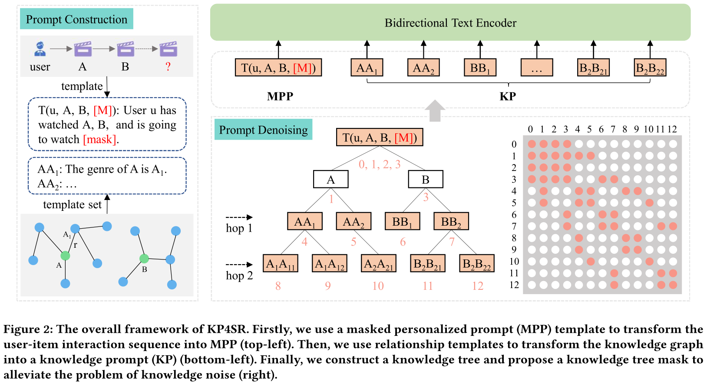

# KP4SR

The source code for our paper: *Knowledge Prompt-tuning for Sequential Recommendation*.

## Overview

  

## Preparation

Our code runs on the Ascend 910 NPU of Huawei modelarts.

- Ascend 910ProA
- torch == 1.8.1+ascend.rc3.20221020
- torch-npu == 1.8.1rc3.post20221020

## Usage 

- train: run scripts/modelarts_train.sh
- test: run scripts/modelarts_test.sh

